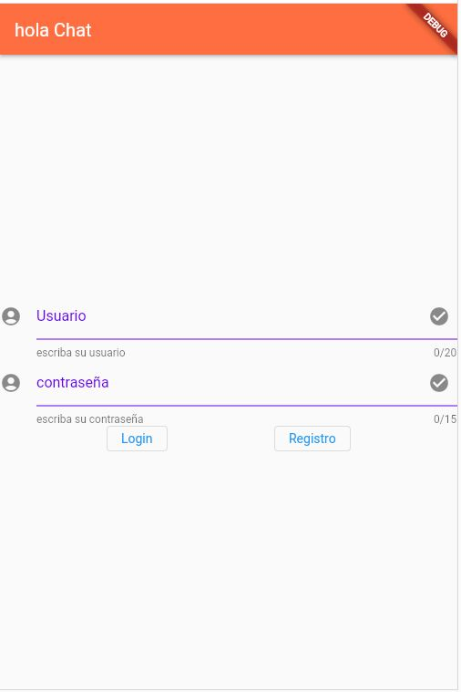

<!--
ESTE README DESCRIBE LA CARPETA AUTH_VIEWS. 

EN ELLA VAMOS A TENER TODAS LAS VISTAS DE LAS DIFERENTES FORMAS DE AUTENTIFICACIÓN
-->


# README AUTH_VIEWS

ESTE README DESCRIBE LA CARPETA AUTH_VIEWS.

EN ELLA VAMOS A TENER TODAS LAS VISTAS DE LAS DIFERENTES FORMAS DE AUTENTIFICACIÓN

## EJEMPLO DE CLASE AUTH

EJEMPLO DE AUTH CON CORREO ELECTRÓNICO


```dart

class LoginView extends StatelessWidget {

  const LoginView({Key? key}) : super (key: key);
  

  @override
  Widget build(BuildContext context) {
    RFInputText rfloginText = RFInputText (
      //sValorInicial: ,
      iLongitudPalabra:20,
      sHelperText: "escriba su usuario",
      sTitulo:"Usuario",
      icIzquierdo: Icon(Icons.account_circle),);

    RFInputText rfpasswordText = RFInputText(
      //sValorInicial: ,
      blIsPasswordInput: true,
      iLongitudPalabra:15,
      sHelperText: "escriba su contraseña",
      sTitulo:"contraseña",
      icIzquierdo: Icon(Icons.account_circle),);
    return Scaffold(
        appBar: AppBar(
          title: const Text("hola Chat"),
          backgroundColor: Colors.deepOrangeAccent,
        ),
        //backgroundColor: Colors.amberAccent,
        body: Center(
            child: Column (
                mainAxisAlignment: MainAxisAlignment.center,
                children:  [
                  rfloginText,
                  rfpasswordText,
                  Row(
                    mainAxisAlignment:MainAxisAlignment.spaceEvenly ,
                    children: [
                      OutlinedButton(
                        onPressed: () {
                          loginPressed(rfloginText.getText(),rfpasswordText.getText(), context);
                          print("botón login");
                        },
                        child: Text("Login"),
                      ),
                      OutlinedButton(
                        onPressed: () {
                          Navigator.of(context).popAndPushNamed("/registerView");
                          print("botón registro");
                          // Respond to button press
                        },
                        child: Text("Registro"),
                      )
                    ],
                  )
                  ]
            )
        )
    );

  }
}
```


## TIPOS DE AUTH

CORREO ELECTRONICO
TELEFONO
GOOGLE
FACEBOOK


## CAPTURA DE VISTA DE LOGIN


