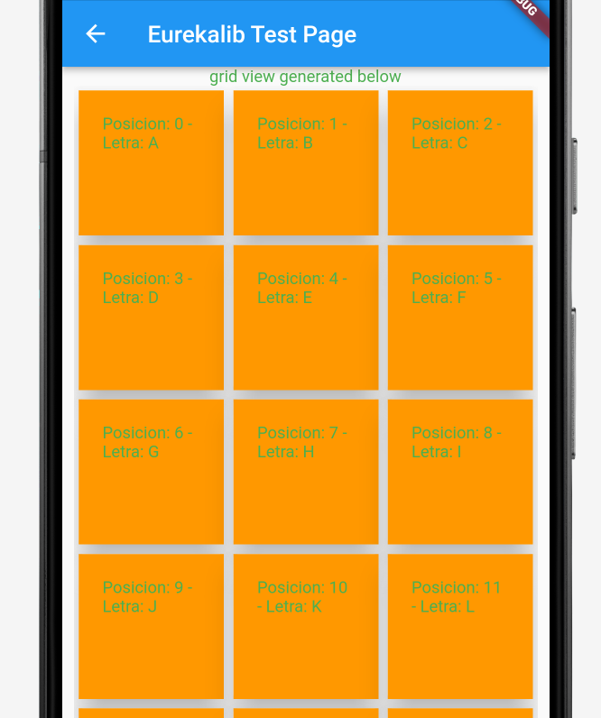

# Ficheros de la carpeta grid_views

### 1. GenericGridView
La clase GenericGridView es de tipo StatelessWidget y devuelve 
un objeto de tipo GridView.builder. 

La ventaja de su uso desde el código cliente radica en que
el tipo de widget con el que GridView construye la malla
está desacoplado del propio objeto GenericGridView, 
de modo que el Widget con el que realiza la malla no está 
predeterminado y puede construirse en el código cliente. 

Ver ejemplo de uso:

a) Creamos nuestro Widget que construye una Card (puede ser cualquier otro Widget)

```dart
class LetterCard extends StatelessWidget {

  final int position;
  final String charReceived;

  const LetterCard({super.key, required this.position, required this.charReceived});

  @override
  Widget build(BuildContext context) {

    return Card(
      elevation: 20,
      child: Container(
        color: Colors.orange,
        padding: EdgeInsets.all(20),
        child: Text("Posicion: ${position} - Letra: ${charReceived}"),
      ),
    );
  }

}
```
b) Ejemplo de uso de GenericGridView dentro de nuestro código cliente:

```dart
class GenericGridViewExample extends StatefulWidget {
  @override
  State<StatefulWidget> createState() => _GenericGridViewExampleState();
}

class _GenericGridViewExampleState extends State<GenericGridViewExample> {

  late bool isListReady = false;  //> flag para comprobar que la lista esta cargada
  List<String> alphabet = []; //> preparamos la lista
  // trabajo con String pero esto podrian ser custom objects

  @override
  void initState() {
    initStringList().whenComplete(() {
      setState(() {
        // cuando esta funcion finaliza, se cambia la flag
        isListReady = true;
      });
    });
    super.initState();
  }

  Future<void> initStringList() async {
    //> cargamos la lista de contenido
    for(int i=65; i<=90; i++) {
      setState(() {
        alphabet.add(String.fromCharCode(i));
      });
    }
  }

  Function elementBuilder() {
    // esta funcion es la clave del proceso
    // recupera el objeto en la posicion index
    // se puede llamar a la funcion de cualquier modo, eso no es relevante
    return (BuildContext context, int index) => LetterCard(
        position: index,
        charReceived: alphabet[index]
    );
    // podemos ver que no estamos pasando objetos, sino un indice
    // que permite recorrer la lista de objetos que tengamos
  }

  
  @override
  Widget build(BuildContext context) {
    return Scaffold(
      appBar: AppBar(title: Text("Eurekalib Generic Grid View Test Page"),),
      body: SingleChildScrollView(
        child: Column(
          children: [
            const Text("grid view generated below"),
            Container(
              height: MediaQuery.of(context).size.height*0.8,
              padding: const EdgeInsets.only(left: 10, right: 10),
              child: isListReady? GenericGridView(
                axisCount: 3, //> puedes cambiar las columnas desde aqui
                elementCount: alphabet.length, // siempre la longitud de la lista
                elementBuilder: elementBuilder, // la funcion itera sobre nuestro Widget de muestra
              ) : const Center(child: Text("loading..."),),
            )
          ],
        ),
      ),
    );
  }
}
```

Resultado:



### 2. RoomCard